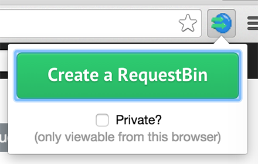

RequestTab
==========

Quickly create [RequestBin](http://requestb.in) urls in a Google Chrome Extension

How Do I Get It?
----------------

[Chrome Web Store]()

or

1. Clone the repo, or download the source and uncompress it
1. Run `bower install` in the directory to install dependencies
1. Enable developer mode for extensions
1. Load an unpacked extension
1. Select the `request-tab` folder
1. Use!

License
-------
MIT
